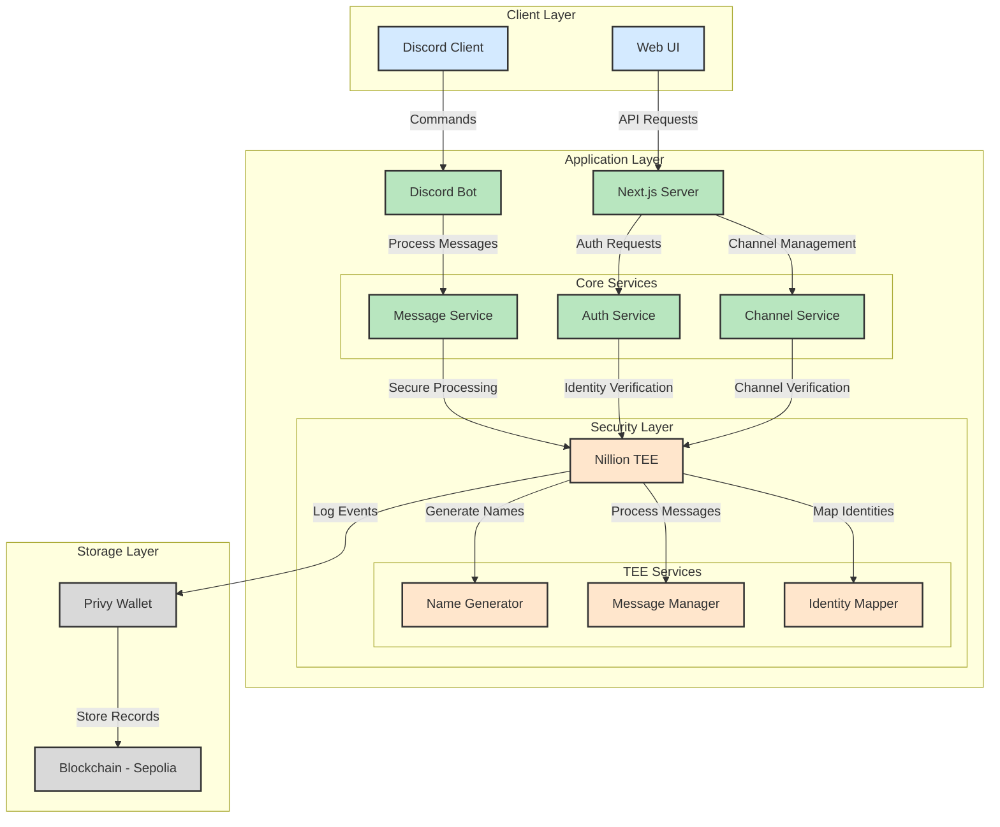

# Technical Architecture



## Component Details

### Client Layer
- **Discord Client**: User interface for Discord commands and messages
- **Web UI**: Administrative interface and channel management

### Application Layer
- **Next.js Server**: Main application server handling web requests
- **Discord Bot**: Processes Discord commands and messages
- **Core Services**:
  - Message Service: Handles message processing and routing
  - Auth Service: Manages user authentication and sessions
  - Channel Service: Manages anonymous chat channels

### Security Layer (Nillion TEE)
- **Name Generator**: Creates unique anonymous usernames
- **Message Manager**: Processes and sanitizes messages
- **Identity Mapper**: Manages user-anonymous ID mappings

### Storage Layer
- **Privy Wallet**: Manages blockchain transactions
- **Sepolia Blockchain**: Stores message hashes and metadata

## Data Flow

1. **Message Flow**:
   ```
   User -> Discord -> Bot -> Message Service -> TEE -> Privy -> Blockchain
   ```

2. **Channel Creation**:
   ```
   Admin -> Web UI -> Next.js -> Channel Service -> TEE -> Discord Bot
   ```

3. **Authentication**:
   ```
   User -> Discord/Web -> Auth Service -> TEE -> Identity Mapper
   ```

## Security Considerations

1. **Privacy**:
   - All user-identifiable data processed in TEE
   - Messages sanitized before broadcasting
   - Random usernames per message

2. **Integrity**:
   - Message hashes stored on blockchain
   - TEE ensures secure processing
   - Cryptographic signatures for verification

3. **Access Control**:
   - Admin commands restricted by role
   - Channel-specific permissions
   - TEE-based identity verification
